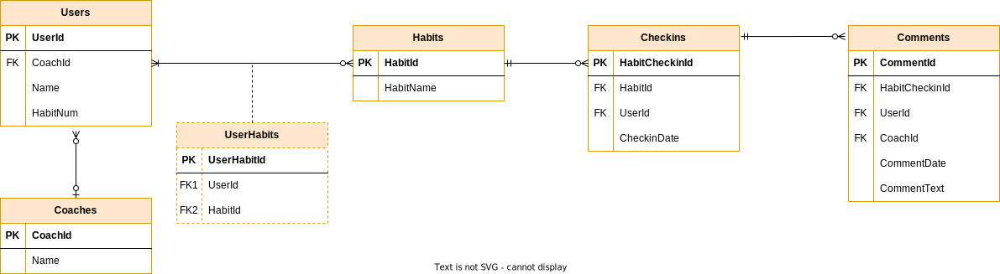

# Demo Structure DataWarehouse Team 
This repository is to provide a sample for a team moving from VSS to Git (BitBucket/GitHub) and understanding where files could go

## Sample referencing files
The design documentation can be stored in the repository or it can be stored in a separate system.
The following is a way to reference images

### Image
Here's an image 

### Link to file in repo

* [PDF Version of ERD Diagram](docs/SampleERDDiagramPDF.drawio.pdf)
* [HTML Rendering of ERD Diagram](docs/SampleERDDiagram.drawio.html)
* [Drawio file that can be updated](docs/SampleERDDiagram.drawio)

## Contributing to the Repos / Working in GitHub
Add some content here on how to create a branch, pull request, approval, and merge

## Code of Conduct
how to work with others in the repository

## License
when creating public repositories there might be a license file to explain how the contents may be used.

